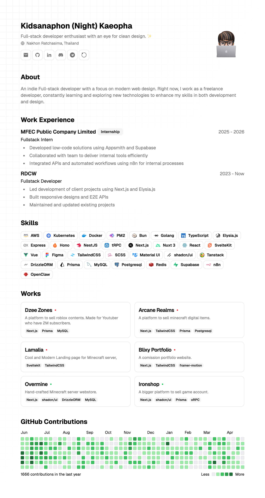

Disclaimer; บทความนี้เป็นบทความแรกในชีวิตของเรา กำลังฝึก storytelling น่ะ อาจจะมีอ่านงงๆบ้าง ขออภัยมา ณ ที่นี้ด้วยคั้บ 🙏

ในยุคที่ AI เข้ามามีบทบาทในชีวิตมากขึ้น ทำให้เกิดเว็ปไซต์ที่ถูกสร้างด้วย AI มากมาย เรารู้สึกว่าตั้งแต่มี AI เข้ามา ทำให้ Standard UX/UI ของเว็ปไซต์ มันค่อนข้างที่จะลด Gap ระหว่างดีไซน์เองเยอะพอควร คือตอนนี้สำหรับเราอะ ใครมี AI แล้ว Prompt เก่งๆ + รู้จัก Tools (เช่น Impeccable) ก็สามารถผลิตผลงานที่ดีออกมาได้แล้ว

ณ ตอนนี้ เรายอมรับว่าเราให้ AI ทำงานแทนเราไปได้หลายส่วนเลย โดยเฉพาะส่วนของการดีไซน์ UX/UI แต่เพราะแบบนี้ เรารู้สึกว่าผลงานที่เราทำออกมา มันไม่น่าพอใจเท่าที่ควรจะเป็น เพราะเหตุนั้นเราจึงลองกลับไปสร้างเว็ปไซต์ **โดยที่ไม่ใช้ AI ดีไซน์แม้แต่นิดเดียว** จนได้เว็ปไซต์นี้ขึ้นมา เว็ปไซต์นี้เป็นเว็ปไซต์ส่วนตัวของเรา เราตั้งใจแสดงถึง Perspective, Tastes และ Identity ของเราเอง เมื่อก่อนเว็ปเก่าเราจะหน้าตาเป็นแบบนิ

ดูโคตร AI สุดๆเลยปะ 555555 แต่ตอนนี้ก็เป็นอย่างที่เห็นเลย เว็ปไซต์นี้เราใช้ Astro ในการสร้างแทนเว็ปเก่าที่เป็น Next.js น่ะ เพราะว่า เราอยากลองใช้ Framework ตัวนี้กับงานจริงมั่ง หลังจากที่เคยแค่แตะๆ ดู ซึ่งระหว่างที่เราทำได้เห็นข้อดีข้อเสียหลายๆอย่างด้วย เช่น เรียนรู้ง่ายมาก ถ้ามีพื้นฐานอยู่แล้ว และเว็ปโหลดไวมาก แต่ก็ trade-off กับ Ecosystem ก็น้อยเช่นกัน

หลังจากที่เรานั่งทำอยู่ 3-4 ชั่วโมง โดยไม่ใช้ AI ดีไซน์เลย เรารู้สึกเหมือนได้กลับมาจับสิ่งที่ตัวเองถนัดและทำมันได้ดีอีกครั้ง เรารู้สึกภูมิใจในผลงานตัวเองมากขึ้น เพราะเราได้ลงแรงทำกับมัน

คิดไม่ออกละจะพิมไรต่อ สุดท้ายนี้ เราคิดว่า AI มันก็ดีไซน์เว็ปแทนเราได้แหละ แต่เราจะเสีย Identity ของเราไป เหมือนกับมีคนมาปลอมลายเซ็นต์ของเรา สุดท้ายนี้คงต้องบอกตัวเองบ่อยๆ ถ้างานไหนมันมีเวลาให้ทำเยอะ ก็ทำเองเถอะ 😆
